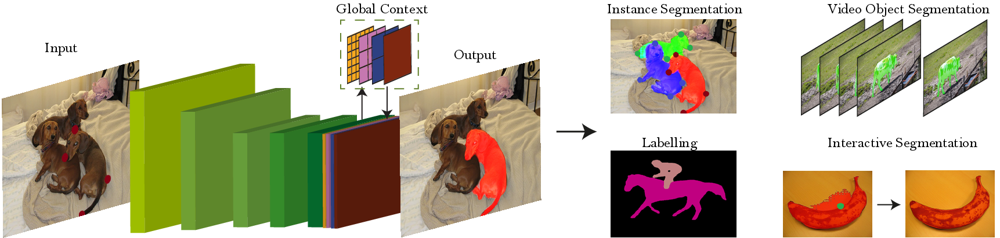

# DEXTR-PyTorch - Forked Repository

This is a fork of the original [DEXTR-PyTorch](https://github.com/scaelles/DEXTR-PyTorch) repository with some modifications and updates (mainly numpy version). The **Deep Extreme Cut (DEXTR)** is a method for object segmentation from extreme points (left-most, right-most, top, and bottom pixels). This implementation works by adding an additional channel to the image to represent the extreme points, enabling precise segmentation with minimal user input.

For the original project details, visit the [official DEXTR page](http://www.vision.ee.ethz.ch/~cvlsegmentation/dextr).




---

### Installation

The code was tested with [Miniconda](https://conda.io/miniconda.html) and Python 3.6. Follow the steps below to get started:

#### 1. Clone the repository:

```bash
git clone https://github.com/StevetheGreek97/DEXTR-SMe
cd DEXTR-SMe
```

#### 2. Install dependencies:

Install PyTorch, torchvision, and other dependencies:

```bash
conda install pytorch torchvision -c pytorch
conda install matplotlib opencv pillow scikit-learn scikit-image
```

#### 3. Download the pre-trained model:

Run the following script to download the pre-trained DEXTR model:

```bash
cd models/
chmod +x download_dextr_model.sh
./download_dextr_model.sh
cd ..
```

The default model is trained on **PASCAL VOC Segmentation train + SBD** (10582 images). Other models (e.g., PASCAL or COCO) can be downloaded from the [official project page](http://www.vision.ee.ethz.ch/~cvlsegmentation/dextr/#downloads).


### Pre-trained Models

You can use the following pre-trained DEXTR models under the **MIT license**:

* **[PASCAL + SBD](https://data.vision.ee.ethz.ch/kmaninis/share/DEXTR/Downloads/models/dextr_pascal-sbd.pth)**: Trained on PASCAL VOC Segmentation train + SBD (10582 images). Achieves mIoU of **91.5%** on PASCAL VOC Segmentation val.
* **[PASCAL](https://data.vision.ee.ethz.ch/kmaninis/share/DEXTR/Downloads/models/dextr_pascal.pth)**: Trained on PASCAL VOC Segmentation train (1464 images). Achieves mIoU of **90.5%** on PASCAL VOC Segmentation val.
* **[COCO](https://data.vision.ee.ethz.ch/kmaninis/share/DEXTR/Downloads/models/dextr_coco.pth)**: Trained on COCO train 2014 (82783 images). Achieves mIoU of **87.8%** on PASCAL VOC Segmentation val.

---

### Citation

If you use this code, please cite the following papers:

1. **Deep Extreme Cut: From Extreme Points to Object Segmentation**:

   ```bibtex
   @Inproceedings{Man+18,
     Title          = {Deep Extreme Cut: From Extreme Points to Object Segmentation},
     Author         = {K.K. Maninis and S. Caelles and J. Pont-Tuset and L. {Van Gool}},
     Booktitle      = {Computer Vision and Pattern Recognition (CVPR)},
     Year           = {2018}
   }
   ```

2. **Extreme Clicking for Efficient Object Annotation**:

   ```bibtex
   @InProceedings{Pap+17,
     Title          = {Extreme clicking for efficient object annotation},
     Author         = {D.P. Papadopoulos and J. Uijlings and F. Keller and V. Ferrari},
     Booktitle      = {ICCV},
     Year           = {2017}
   }
   ```

---

### License

The code is released under the MIT license. See the `LICENSE` file for more information.

---

Feel free to modify this further depending on any additional customizations or instructions relevant to your specific fork.
